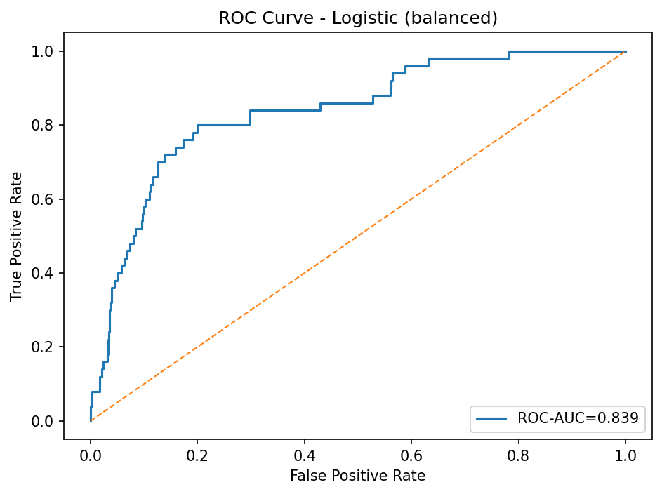
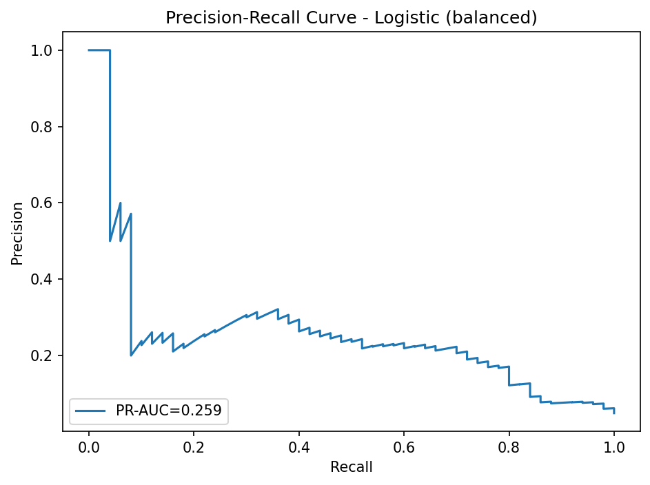
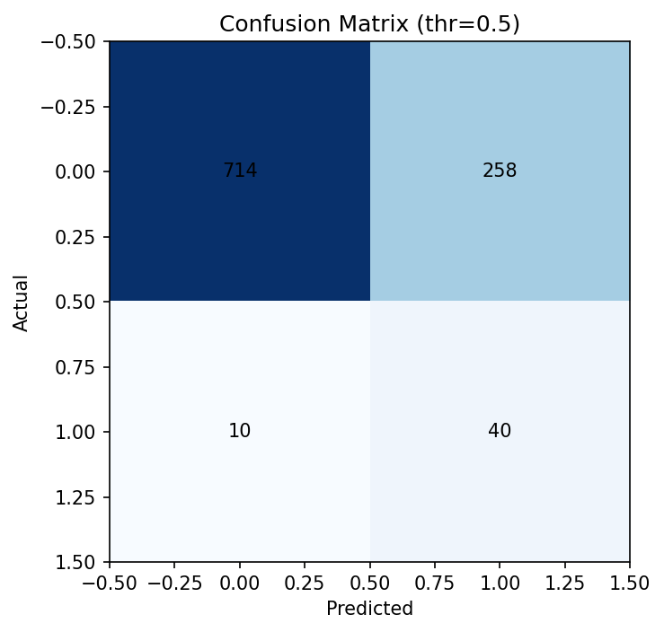

# Stroke Prediction (EDA + Logistic Baseline)
Predicting stroke risk using demographic and clinical data with a logistic regression baseline.


## 📊 Overview
- **목표**: 환자의 인구학적 정보와 임상 데이터를 활용하여 뇌졸중 발생 위험을 예측하는 머신러닝 모델 개발
- **핵심 가치**: 의료진이 고위험 환자를 조기에 식별하여 예방적 치료를 제공할 수 있도록 지원


## 🎯 Key Achievements
- 재현율(Recall) **80%** 달성 → Successfully achieved Recall of 80% 
- ROC-AUC **0.839**로 우수한 분류 성능 구현  
- 클래스 불균형 문제를 **class_weight='balanced'**로 대응 


## 📈 Dataset Information
- **출처**: [Kaggle Stroke Prediction Dataset](https://www.kaggle.com/datasets/fedesoriano/stroke-prediction-dataset)  
- **샘플 수**: 5,110개 (뇌졸중 발생: 249개, 미발생: 4,861개)  
- **클래스 불균형 비율**: 약 19:1  
- **특성 변수**: 나이, 성별, 고혈압, 심장병, 결혼상태, 직업, 거주지역, 평균혈당수치, BMI, 흡연여부


## 🔧 기술 스택
- **데이터 처리 & 분석**  
  - pandas: 데이터 조작 및 전처리  
  - numpy: 수치 연산  
- **머신러닝**  
  - scikit-learn: Pipeline, ColumnTransformer, LogisticRegression  
  - class_weight='balanced': 불균형 데이터 대응  
- **시각화**  
  - matplotlib: 정적 그래프  
  - Plotly: 인터랙티브 차트  


## 🗂 Project Structure
```
stroke-prediction/
├─ data/
│   └─ stroke_clean.csv    # 전처리된 데이터
├─ notebooks/
│   ├─ 01_eda.ipynb        # 탐색적 데이터 분석 및 전처리
│   └─ 02_modeling.ipynb   # 모델 학습 및 평가
├─ figures/                # 시각화 결과물
└─ README.md
```
- **Notebooks**:  
  - [01_eda.ipynb](notebooks/01_eda.ipynb)  
  - [02_modeling.ipynb](notebooks/02_modeling.ipynb)

- **Key Figures**:  
  ROC | PR
  --- | ---
   | 

- **Confusion Matrix**:  
    
  *(튜닝 임곗값 결과도 기본값과 동일한 분포였음)*

- **Clean Data**: [`data/stroke_clean.csv`](data/stroke_clean.csv)  


## ✅ Results (Logistic, class_weight=balanced)
- Accuracy **0.738** · Precision **0.134** · Recall **0.800** · F1 **0.230**  
- ROC-AUC **0.839** · PR-AUC **0.259**
  불균형 데이터 상황에서도 재현율(Recall) 0.80으로 환자를 놓치지 않는 모델을 구현했지만, 정밀도는 낮음. 향후 RandomForest, XGBoost 등의 기법으로 개선 여지 있음.
